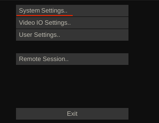
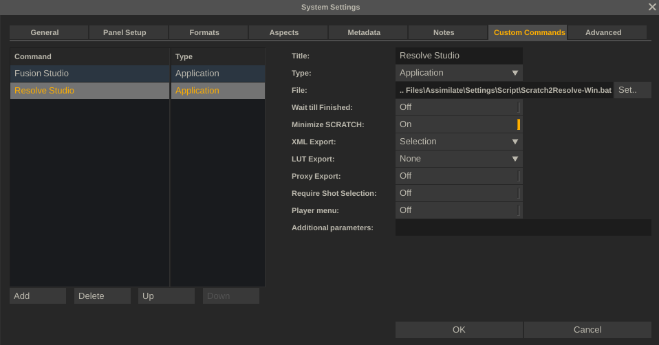
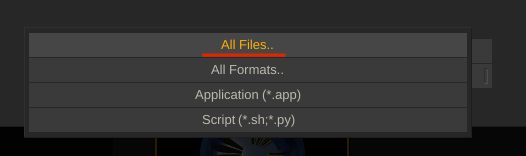
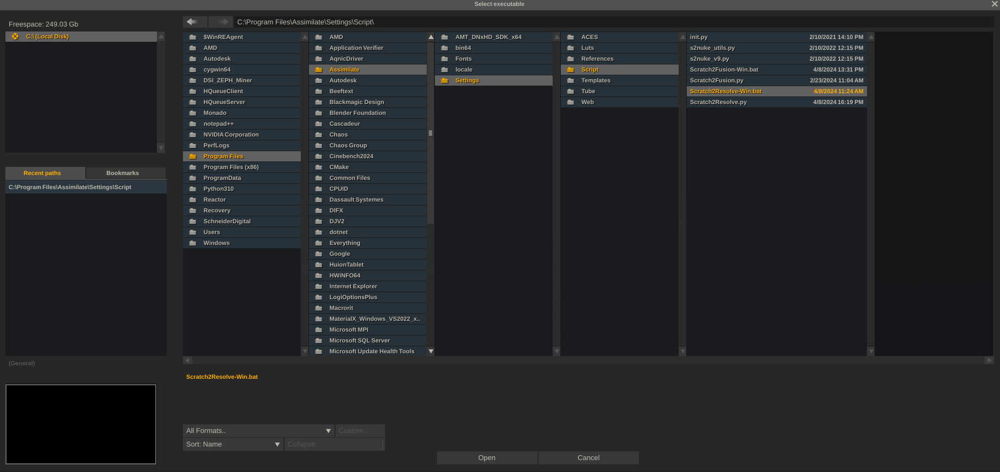
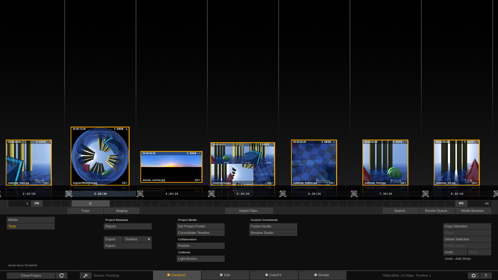
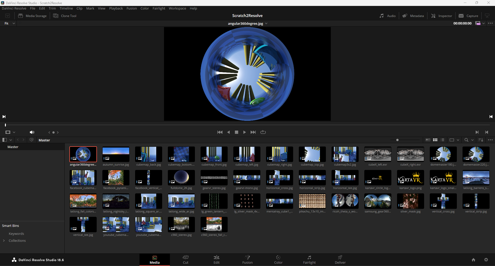

# Scratch to Resolve

Doc Created: 2024-04-08  
Doc By: Andrew Hazelden <andrew@andrewhazelden.com>  

# Overview:
This script imports Assimilate Scratch/LiveFX content into BMD Resolve Studio.

Each clip is created as a media pool item. The filename, clip color, and comment attributes are assigned to each media pool item.

# Script Installation:

## Part A

Copy the included scripts into the "Assimilator/Defaults/Script/" folder on your hard disk.

On macOS this folder is located at:

		/Library/Application Support/Assimilator/Defaults/Script/

On Windows this folder is located at:

		C:\Program Files\Assimilate\Settings\Script\

## Part B

How to Enable the "Scratch to Resolve" script: 

1. Launch BMD Fusion Studio and Assimilate Scratch/LiveFX.

2. Once Assimilate has launched, click on the "System Settings..." button on the splash screen.

3. In the "System Settings" dialog select "Custom Commands".  

Add a new Custom Command entry:

MacOS Custom Command:

		Title: Resolve Studio
		Type: Application
		File: /Library/Application Support/Assimilator/Defaults/Script/Scratch2Resolve-macOS.command
		XML Export: Selection

Windows Custom Command:

		Title: Resolve Studio
		Type: Application
		File: C:\Program Files\Assimilate\Settings\Script\Scratch2Resolve-Win.bat
		XML Export: Selection

To define the File attribute, click the "Set" button.

4. In the "Select Executable" dialog change the "All Formats..." pop-up menu to "All Files..." to allow the selection of more file types.

Then in the path entry text field at the top-center of the dialog paste in the text:

macOS Path:

		/Library/Application Support/Assimilator/Defaults/Script/Scratch2Resolve-macOS.command

Windows Path:

		C:\Program Files\Assimilate\Settings\Script\

Make sure the file "Scratch2Resolve-macOS.command" or "Scratch2Resolve-Win.bat" is selected. Then press the "Open" button to close the dialog.

5. Open a Scratch project and switch to the Construct tab. Select several clips.  In the Construct tab click on the "Tools" button. Then click on the Custom Commands > Fusion Studio" button to run this script.

6. Switch to Resolve Studio. The selected Scratch clips are now displayed in the media pool.

## Troubleshooting

The "Scratch2Resolve-Win.bat" script on Windows expects your Python 3 executable to be in the PATH environment variable, and to have the filename of "python.exe". You can revise the script if your executable is named "python3.exe" or you want to use an absolute filepath.

If you click on the "Resolve Studio" custom command button and see the command prompt based error message "Could not connect to the foreground Resolve session" it means the Fusion Render Node or Fusion Studio processes running on the same system intercepted the content that was being passed to Resolve Studio. Quit the Fusion Render Node/Fusion Studio processes and things should work as expected.

If you click on the "Resolve Studio" custom command button and see the command prompt based error message "the following arguments are required: xml_path" it means you need to go back and adjust the custom command parameters. Change the "XML Export:" setting to "Selection".

