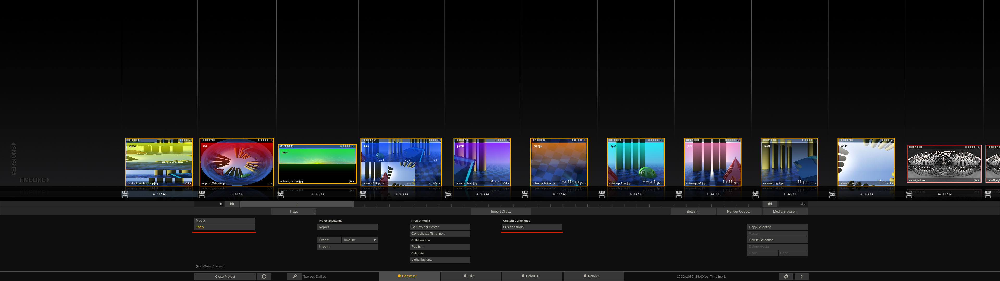
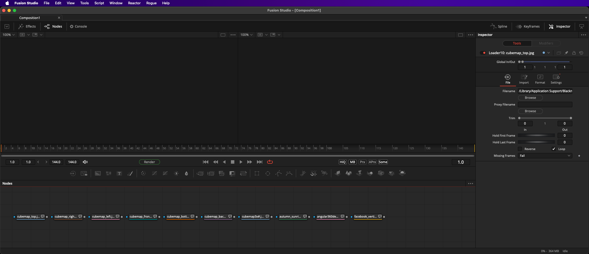

# Scratch to Fusion

Doc Created: 2024-02-21  
Doc By: Andrew Hazelden <andrew@andrewhazelden.com>  

# Overview:
This script imports Assimilate Scratch/LiveFX tray content into BMD Fusion Studio.

Each tray clip is created as a Loader node in Fusion. The filename, tile color, and comment attributes are assigned to each node.

# Script Installation:

## Part A

Copy the two scripts "Scratch2Fusion-macOS.command" and "Scratch2Fusion.py" into the "Assimilator/Defaults/Script/" folder on your hard disk.

On macOS this folder is located at:

		/Library/Application Support/Assimilator/Defaults/Script/

## Part B

How to Enable the "Scratch to Fusion" script: 

1. Launch BMD Fusion Studio and Assimilate Scratch/LiveFX.

2. Once Assimilate has launched, click on the "System Settings..." button on the splash screen.

3. In the "System Settings" dialog select "Custom Commands".  

Add a new Custom Command entry:

		Title: Fusion Studio
		Type: Application
		File: /Library/Application Support/Assimilator/Defaults/Script/Scratch2Fusion-macOS.command
		XML Export: Selection

To define the File attribute, click the "Set" button.

4. In the "Select Executable" dialog change the "All Formats..." pop-up menu to "All Files..." to allow the selection of more file types.

Then in the path entry text field at the top-center of the dialog paste in the text:

		/Library/Application Support/Assimilator/Defaults/Script/Scratch2Fusion-macOS.command

Make sure the file "Scratch2Fusion-macOS.command" is selected. Then press the "Open" button to close the dialog.

5. Open a Scratch project and switch to the Construct tab. Select several clips in the Tray.  In the Construct tab click on the "Tools" button. Then click on the Custom Commands > Fusion Studio" button to run this script.

6. Switch to Fusion Studio. The Scratch Tray items are now displayed in Fusion.

